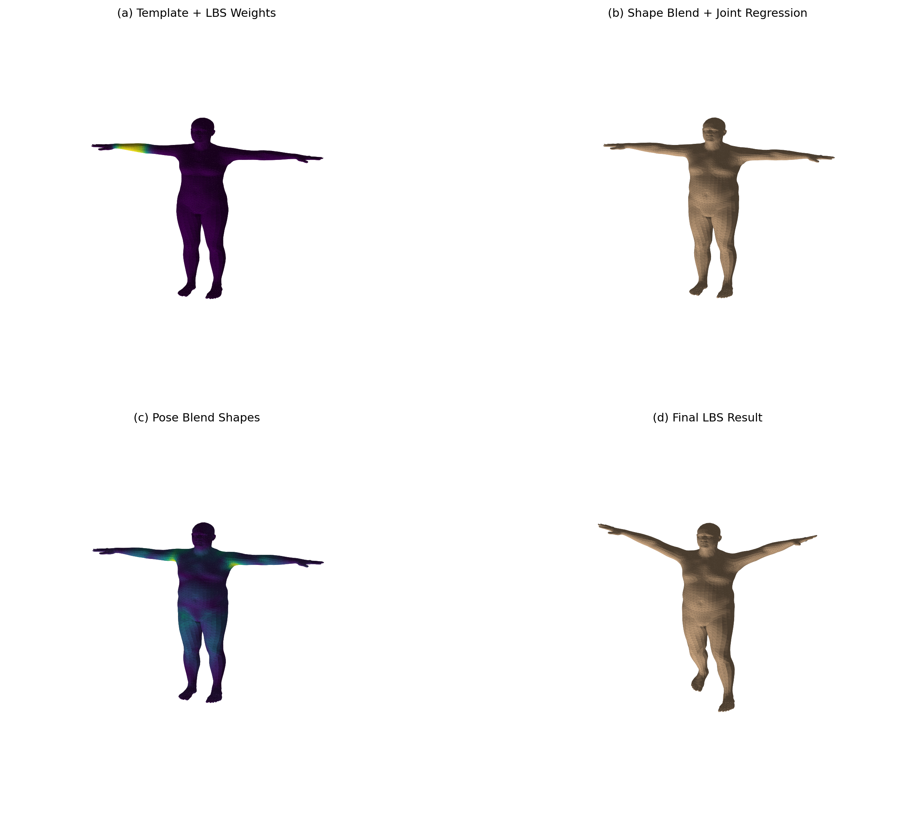
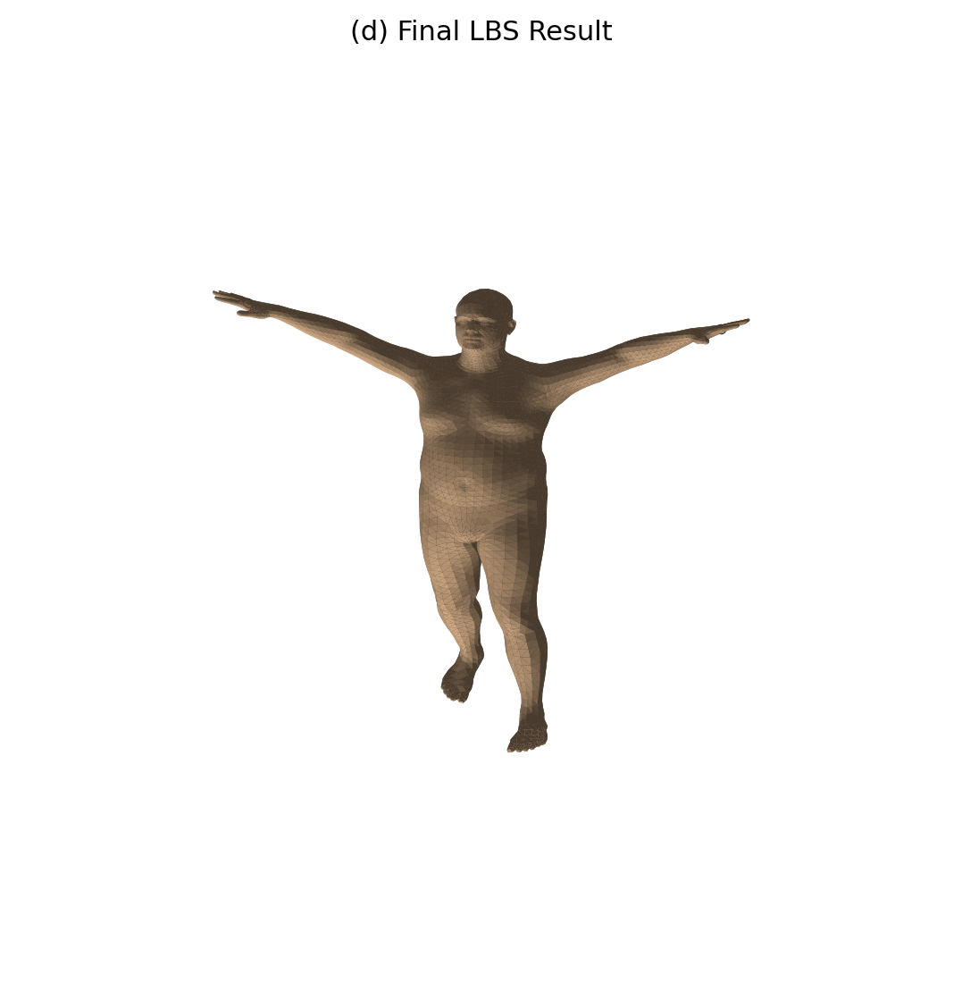

# SMPL LBS 可视化实验 202411081102-简子越-人智

本实验基于 SMPL 人体模型，手写实现一次完整的 Linear Blend Skinning (LBS) 蒙皮流程，并将每个关键阶段保存为图片。实验还将手写 LBS 的最终顶点结果与 `smplx` 官方模型前向输出逐顶点比较，用数值误差验证实现正确性。

## 1. 实验目标

1. 理解 SMPL 模型中形状参数、姿态参数、关节回归、姿态校正和蒙皮权重的作用。
2. 手写复现 SMPL 的 LBS 主要计算步骤。
3. 可视化 LBS 中间过程，包括模板网格、形状变形、姿态校正和最终蒙皮结果。
4. 展示指定关节的 LBS 权重热力图。
5. 对比手写 LBS 与官方 forward 的输出结果，验证两者是否一致。

## 2. 项目结构

```text
eight_Lab/
├── README.md
├── run_lbs_lab.py
├── models/
│   └── smpl/
│       └── SMPL_NEUTRAL.pkl
└── outputs/
    ├── stage_a_template_weights.png
    ├── stage_b_shaped_joints.png
    ├── stage_c_pose_offsets.png
    ├── stage_d_lbs_result.png
    ├── comparison_grid.png
    ├── all_joint_weights.png
    └── summary.txt
```

## 3. 环境配置

推荐使用 Conda 创建独立环境：

```powershell
conda create -n cg-lbs python=3.10 -y
conda activate cg-lbs
```

安装依赖：

```powershell
pip install torch numpy matplotlib smplx scipy
```

说明：

- 本实验使用 CPU 版 PyTorch 即可。
- `scipy` 是为了兼容部分旧版 SMPL `.pkl` 模型文件的反序列化。
- 模型文件应放在 `models/smpl/SMPL_NEUTRAL.pkl`。

## 4. 运行方式

在项目根目录下执行：

```powershell
python run_lbs_lab.py --model-dir ./models --out-dir ./outputs --joint-id 18
```

参数说明：

- `--model-dir ./models`：SMPL 模型所在目录。
- `--out-dir ./outputs`：结果输出目录。
- `--joint-id 18`：指定要可视化权重的关节编号。本实验展示的是关节 18。
- `--num-betas 10`：使用 10 个 shape 参数。

如果想查看其他关节的权重热力图，可以修改 `--joint-id` 后重新运行。

## 5. LBS 实现流程

程序中的手写 LBS 主要包括以下步骤：

1. 读取 SMPL 模型中的模板顶点 `v_template`、形状基 `shapedirs`、姿态基 `posedirs`、关节回归器 `J_regressor`、蒙皮权重 `lbs_weights` 和骨架父子关系 `parents`。
2. 构造示例形状参数 `betas`，通过 shape blend shapes 得到形状变形后的网格 `v_shaped`。
3. 使用关节回归器从 `v_shaped` 回归得到人体关节位置 `J`。
4. 构造示例姿态参数 `global_orient` 和 `body_pose`，将 axis-angle 转为旋转矩阵。
5. 根据旋转矩阵计算 pose feature，并通过 pose blend shapes 得到姿态校正偏移 `pose_offsets`。
6. 将 `pose_offsets` 加到 `v_shaped` 上，得到 `v_posed`。
7. 根据骨架层级计算每个关节的刚体变换矩阵。
8. 使用每个顶点的 LBS 权重对关节变换进行加权混合，得到最终蒙皮结果 `verts`。

## 6. 结果摘要

本次运行结果如下：

```text
num_vertices: 6890
num_faces: 13776
num_joints(from lbs_weights): 24
num_betas: 10
visualized_joint_id: 18
manual_vs_official_mean_abs_error: 0.0000000000
manual_vs_official_max_abs_error: 0.0000000000
```

其中：

- 顶点数为 6890。
- 面片数为 13776。
- LBS 权重中包含 24 个关节。
- 手写 LBS 与官方 forward 的平均绝对误差为 0。
- 手写 LBS 与官方 forward 的最大绝对误差为 0。

这说明本实验中的手写 LBS 结果与 `smplx` 官方前向结果一致。

## 7. 效果展示

### 7.1 总览对比图

`comparison_grid.png` 将 LBS 的四个主要阶段放在同一张图中，便于整体观察从模板人体到最终姿态人体的变化。



四个子图分别表示：

- `(a) Template + LBS Weights`：模板网格与指定关节的蒙皮权重。
- `(b) Shape Blend + Joint Regression`：形状参数作用后的网格，以及回归得到的关节。
- `(c) Pose Blend Shapes`：姿态校正后的网格。
- `(d) Final LBS Result`：经过关节层级变换和线性混合蒙皮后的最终结果。

### 7.2 阶段 A：模板网格与指定关节权重

该图显示模板人体网格，并使用颜色表示 `joint-id=18` 对各顶点的影响权重。颜色越明显，表示该关节对该区域顶点的控制越强。


### 7.3 阶段 B：形状混合与关节回归

该图展示形状参数 `betas` 作用后的身体网格。程序设置了几个非零 beta，使体型变化更容易观察。白色点表示通过 `J_regressor` 从网格顶点回归得到的关节位置。


### 7.4 阶段 C：姿态校正

该图展示加入 pose blend shapes 后的网格，并用颜色显示每个顶点姿态校正偏移的大小。该阶段主要用于补偿人体关节旋转后产生的非刚性形变。


### 7.5 阶段 D：最终 LBS 结果

该图展示完整 LBS 计算后的最终人体姿态。它综合了形状变形、姿态校正、骨架刚体变换和蒙皮权重混合。



### 7.6 全关节 LBS 权重分布

该图展示每个面片由哪个关节主导控制，并通过不同颜色区分不同关节区域。它可以直观看到 SMPL 模型中头部、躯干、手臂和腿部等区域的蒙皮权重分布。


## 8. 手写 LBS 与官方 forward 一致性验证

验证任务使用与手写 LBS 完全相同的参数：

- `betas`
- `global_orient`
- `body_pose`

然后调用官方模型：

```python
output = model(
    betas=betas,
    global_orient=global_orient,
    body_pose=body_pose,
    return_verts=True,
)
official_verts = output.vertices
```

再将手写 LBS 的 `verts` 与 `official_verts` 做逐顶点绝对误差比较：

```python
diff = torch.abs(manual_verts - official_verts)
mean_err = diff.mean().item()
max_err = diff.max().item()
```

最终将两项误差指标保存到 `outputs/summary.txt`：

```text
manual_vs_official_mean_abs_error: 0.0000000000
manual_vs_official_max_abs_error: 0.0000000000
```

实验结果表明，手写 LBS 实现与官方 forward 输出一致。

## 9. 输出文件说明

| 文件 | 说明 |
| --- | --- |
| `outputs/stage_a_template_weights.png` | 模板网格与指定关节权重热力图 |
| `outputs/stage_b_shaped_joints.png` | 形状变形后的网格与关节回归结果 |
| `outputs/stage_c_pose_offsets.png` | 姿态校正阶段，颜色表示 pose offset 大小 |
| `outputs/stage_d_lbs_result.png` | 最终 LBS 蒙皮结果 |
| `outputs/comparison_grid.png` | 四个阶段的总览对比图 |
| `outputs/all_joint_weights.png` | 全关节主导权重分布图 |
| `outputs/summary.txt` | 顶点数、面片数、关节数和误差验证结果 |

## 10. 结论

本实验完整复现并可视化了 SMPL 的 LBS 蒙皮过程。从实验结果可以看到，形状参数改变人体体型，姿态参数控制关节旋转，pose blend shapes 修正姿态导致的局部形变，LBS 权重决定每个顶点受不同关节影响的程度。最终，手写实现的顶点结果与官方 `smplx` forward 输出完全一致，说明 LBS 计算流程正确。
